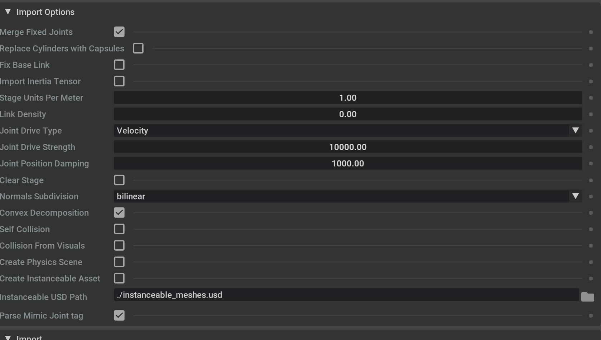

# Things to Remember when importing the drone from URDF:

# How to Configure Custom Drone in USD:
1. Renaming the propeller names to `rotor0` to `rotorN` for N propellers.
2. Rename or Create the Joints connecting rotor to body `joint0` to `jointN` for N propellers. As Joint must be on Z axis and revolute, with following NEU (Nort East Up) Frame convention.
4. Rename main body link to `body`
    -  Give it Mass - `1.5`Kg
    - Diagonal Intertia - x: `0.02912`, y: `0.02912`, z: `0.05522`  
5. in manipulator for all joints add stiffness `100000000000000`.
6. Rename Manipulator joint names:
    - for arm1 link : `arm_1_joint`
    - for arm2 link : `arm_2_joint`
7. Rename Gripper Joints:
    - gripper finger 1: `grip_1_joint`
    - gripper finger 2: `grip_2_joint`
    - gripper finger 3: `grip_3_joint`
8. Set the Articulation root to top level prim, delete from `body` prim.